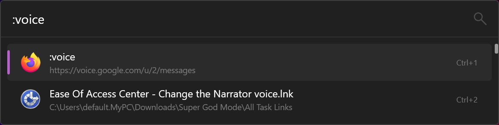
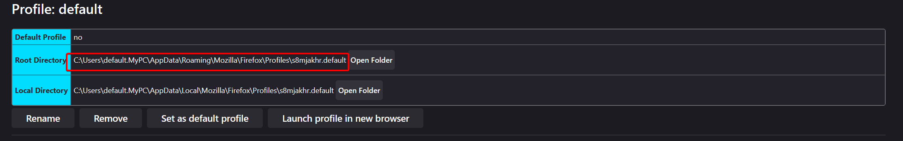

# Flow.Launcher.Plugin.FirefoxKeywordBookmarks
A plugin for flow launcher that lets you open firefox bookmarks from their keyword.

## Useage
Start typing the keyword in the flow launcher menu, and after some time, it will appear.

## How to get profile data path
1. Head to `about:profiles` in firefox.
2. Find the profile that has the bookmarks that you want to use.
3. Copy the root path.

4. Paste it into the settings menu