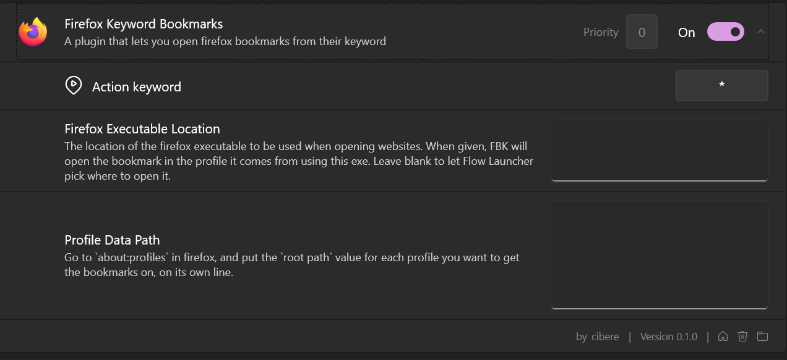
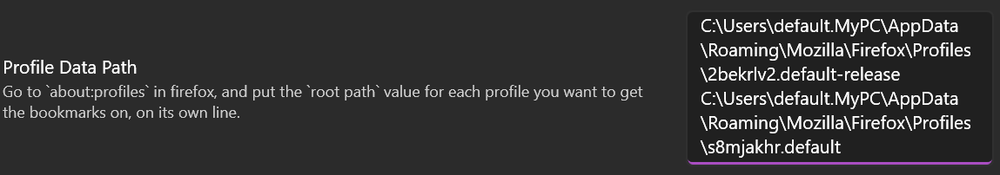
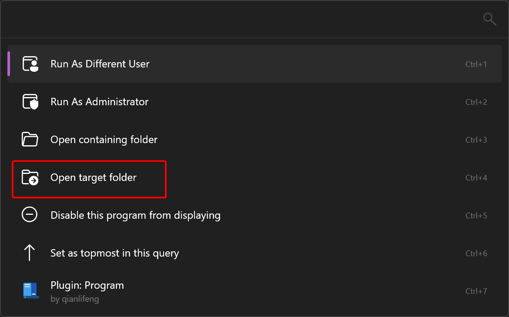
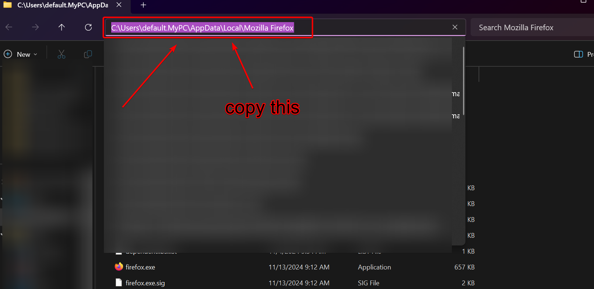
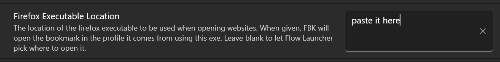

# Flow.Launcher.Plugin.FirefoxKeywordBookmarks
A plugin for flow launcher that lets you open firefox bookmarks from their keyword.

## Prefix System
When adding bookmarks from multiple profiles, you may get to the point where you want to differentiate between them. Our solution? A prefix system. To add a prefix to a profile's bookmarks, head into your plugin settings, and find the line where you put the path to the profile you want. At the start of the line (before the C:/ stuff), add in your prefix followed by a pipe. For example, if your prefix was `!`, you would add `!|` to the start, so the line would read something like: `!|C:\Users\default.MyPC\AppData\Roaming\Mozilla\Firefox\Profiles\s8mjakhr.default`. FKB will then add the prefix to the start of all bookmarks found in that profile.
> [!NOTE]
> The prefix can only be 1 character, but it can be any character.

## Configuration
1. Head to the plugin settings menu, and leave it open

2. Get the root paths of the profile(s) that you want to use.

See the [how to get profile data path section](#how-to-get-profile-data-path) for a step by step guide

3. Go back to the plugin settings menu, and paste in each path onto its own line

4. [OPTIONAL] find your firefox folder and put it in the `Firefox Executable Location` box

See the [How to find your firefox executable section](#how-to-find-your-firefox-executables-folder) for a step by step guide

5. Reload the plugin

If you've set the plugin keyword to something other than `*` (the default is `*`), then type in the keyword and press F5. If not, run the `Reload Plugin Data` command with the `System Commands Plugin`

## Useage
Start typing the keyword in the flow launcher menu, and after some time, it will appear.

## How to get profile data path
1. Head to `about:profiles` in firefox.
2. Find the profile that has the bookmarks that you want to use.
3. Copy the root path.

4. Paste it into the settings menu

## How to find your firefox executable's folder
1. Search "Firefox" in the `Programs` plugin
2. Open up the context menu and press `Open Target Folder`

3. Click on the address bar and copy the path

4. Go into your plugin settings and paste it into the `Firefox Executable Location` box
